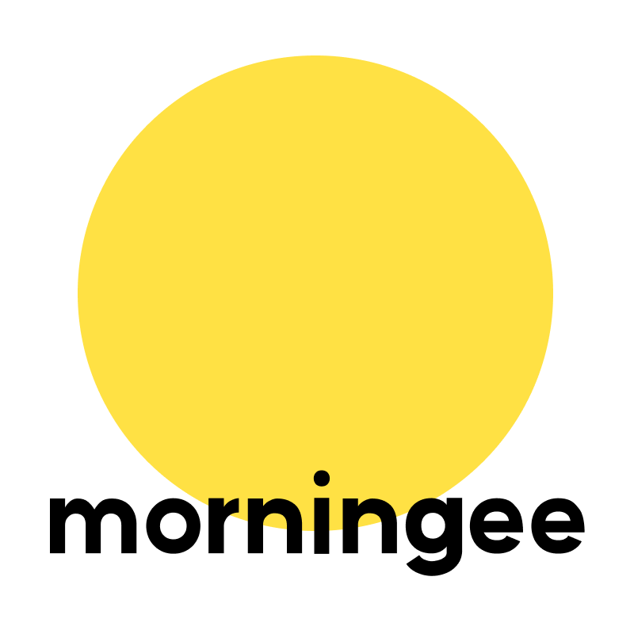
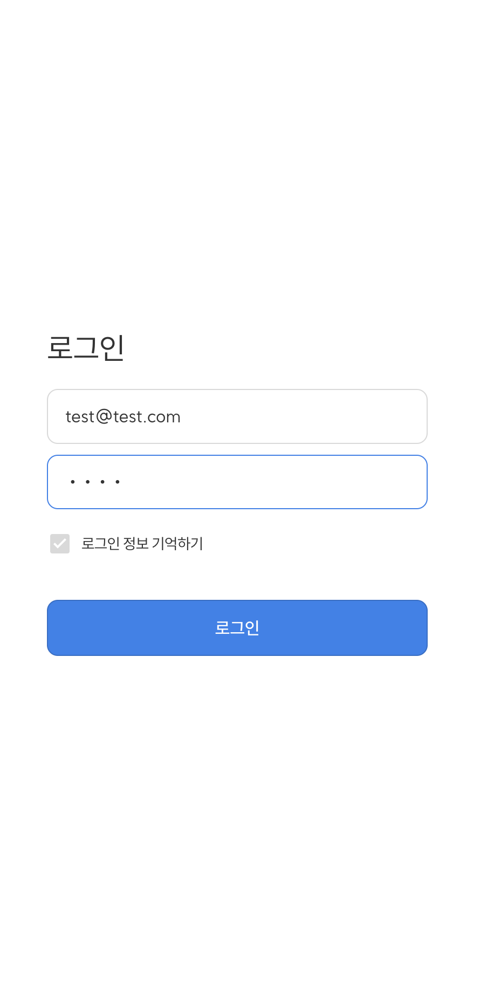

# Morning mission (기상 인증)

   

## 소개

---

아침에 일어나자마자 그 날의 목표 3개를 적어 기상 인증을 합니다.
목표를 작성하고 이를 사람들과 공유해요!

## 백엔드

---

https://github.com/Wunhyeon/goodMorning-server.git

현재는 처음 clone 받아 실행하면 백엔드 없이도 mocking api로 덤프데이터가 보이도록 했습니다.

## 사용 기술

---

React, TypeScript, react-router-dom, styled-components, axios, msw

## 화면

---

1. 로그인

   

 

2. 하루의 목표 3개 적기

   

 

3. 내 목표와 다른 사람들 목표 확인하기

   

 

4. 내 목표 기록 보기

   

 

5. 내 목표 수정하기

   

 
